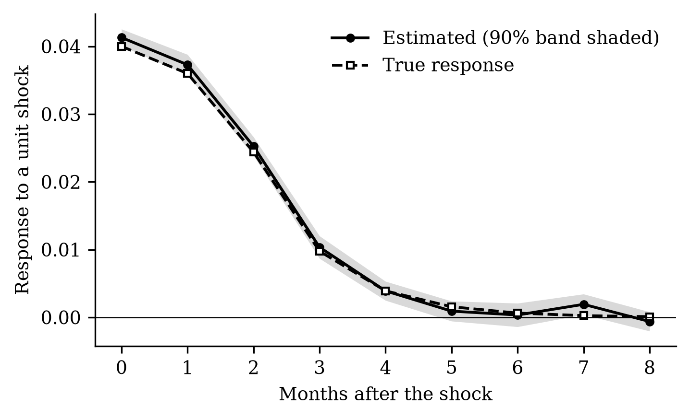
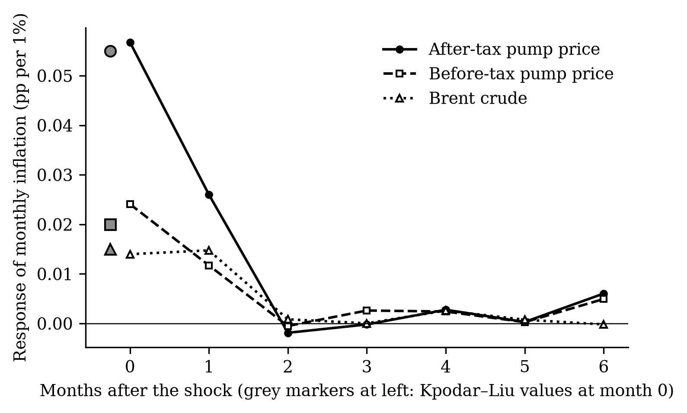
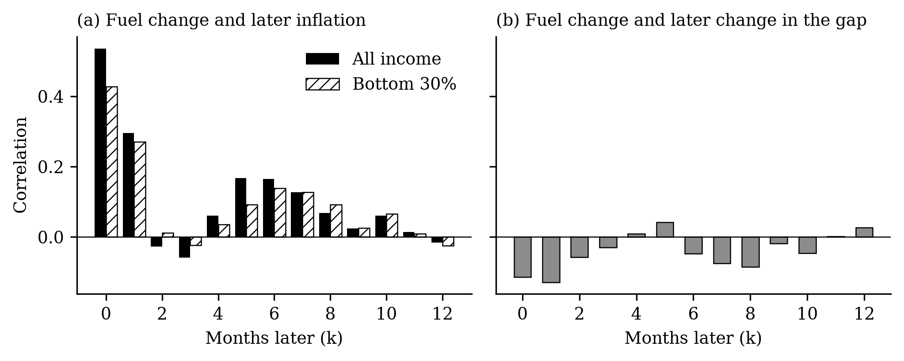
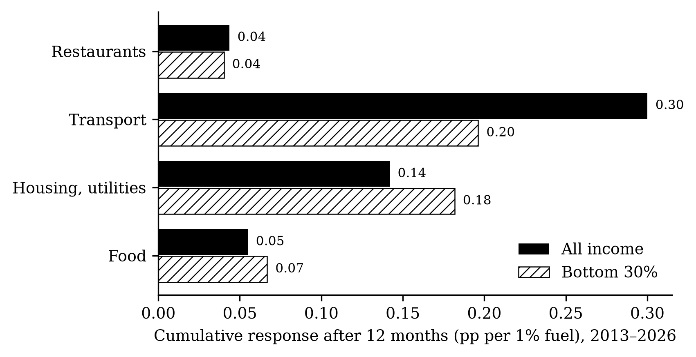
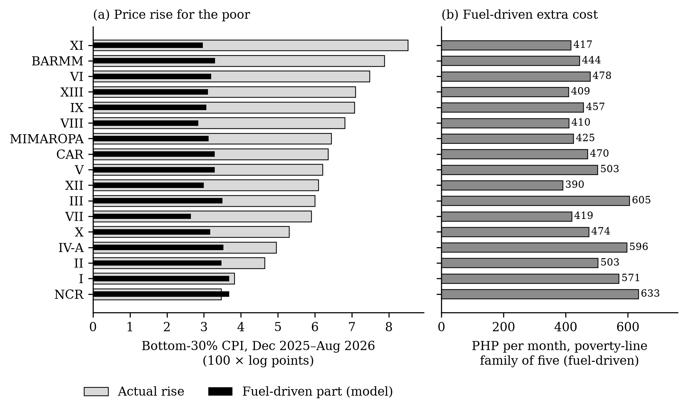
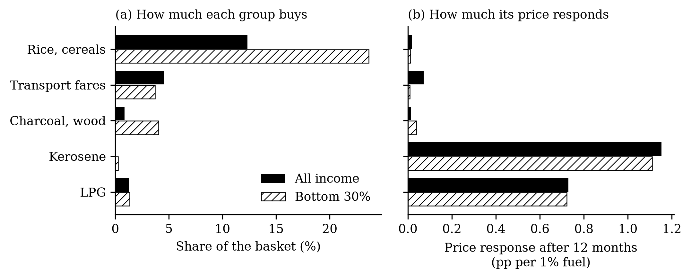

# How to read this report

Each analysis has four parts: **context and process** (why it was done and how), **the figure**, **what the figure shows**, and **what it means** in economic terms. All figures are drawn from the current run of `./run_all.sh`. The complete numerical tables behind every figure are in the *Statistical Annex* (`docs/statistical_annex.docx`).

A few conventions are used throughout. Price changes are measured in log points, which for small changes equal percentage changes. A *response* is the change in a price index, in percentage points, for each 1% rise in fuel prices. The *gap* is ln(CPI all income ÷ CPI bottom 30%); when it falls, the poor's prices have risen more than the average household's. Shaded bands and error bars are 90% confidence intervals: if a band does not cross zero, the effect is statistically significant at the 10% level.

# Part A. Checking the tools

## A1. Does the estimator find the right answer when the answer is known?

**Context and process.** Before using a statistical method on real data, it should be tested where the true answer is known. We generated artificial data for 20 "regions" over 400 months in which a shock raises a variable by 0.040 at once, 0.036 a month later and then fades. We then asked our local projection estimator, with the same settings used in the study, to recover that response.

{width=75%}

**What the figure shows.** The estimated response (solid line) lies almost on top of the true one (dashed line) at every horizon, and the true line stays inside the shaded 90% band.

**What it means.** The estimator does what it is supposed to do. When we later find a particular response in Philippine data, it is not an artefact of the code. Five automated versions of this test run every time the analysis is rebuilt.

## A2. Can we reproduce the reference study?

**Context and process.** The study replicates Kpodar and Liu (2022). Before estimating anything for the Philippines, we required our code to reproduce their published European results, under pass/fail criteria written down in advance. We used EU consumer prices and EU pump prices with and without taxes for 2005–2019, and the Brent crude price, exactly as they did.

{width=80%}

**What the figure shows.** A 1% rise in after-tax pump prices raises inflation by {{ n.rep_after }} pp in the same month (reference: 0.055), by much less for before-tax prices ({{ n.rep_before }}; reference 0.020) and crude oil ({{ n.rep_brent }}; reference 0.015). All three effects disappear by the second month, as in the reference study.

**What it means.** Our implementation reproduces the published results almost exactly, so the Philippine estimates rest on a validated method. The figure also teaches an economic lesson used later: what consumers pay at the pump moves inflation about three times as much as crude oil does, because pump prices include taxes and margins that move with the shock.

# Part B. The data at a glance (Objective 1)

## B1. Twenty-five years of inflation for the poor and for everyone

**Context and process.** We took PSA's monthly consumer price index for all income households and for the bottom 30%, and the CPI sub-index for motor fuels, from 2001 to August 2026, and computed year-on-year inflation for each.

{width=95%}

**What the figure shows.** Panel (a): the two inflation rates usually move together, but the poor's inflation (dashed line) spikes higher in 2008 and runs above the average in 2004–2006, 2018, 2022–2024 and 2026. Panel (b): grey areas, where the poor's inflation is higher, dominate the hatched ones. Panel (c): fuel prices swing far more than consumer prices, with peaks in 2008, 2022 and 2026.

**What it means.** Since 2001 the poor's prices rose about {{ n.d_cum_gap_ph|replace("−","") }} log points (roughly 14%) more than the average household's — their inflation was higher in {{ n.d_years_b30_higher }} of {{ n.d_years_total }} years. The biggest gaps coincide with fuel spikes (2008, 2026), which is why we ask whether fuel is a cause. But 2008 was also a rice crisis, so the picture alone cannot separate fuel from food; the model in Part C does.

## B2. Does a fuel shock show up in prices right away?

**Context and process.** We correlated each month's fuel price change with consumer price changes in the same month and in each of the following twelve months.

{width=95%}

**What the figure shows.** Panel (a): fuel changes are strongly correlated with inflation in the same month ({{ n.d_cc0_all }} for all households) and the next, then again five to eight months later. Panel (b): the correlation with the gap is mostly negative.

**What it means.** Fuel prices affect consumer prices in two waves: a fast, direct wave (fuel itself, fares) and a slower, indirect one (food and other goods whose costs rise). The negative correlations in panel (b) are a first hint that fuel increases are followed by faster price increases for the poor. Correlations do not control for other influences, which is the model's job.

## B3. Where do the poor fall furthest behind?

**Context and process.** For each of the 17 regions we computed average inflation for both groups over 2001–2025 and how far the gap moved over the period.

{width=95%}

**What the figure shows.** Panel (a): in every region the poor's inflation (open square) is above the average (filled circle). Panel (b): the cumulative gap ranges from {{ n.d_cum_gap_min }} in {{ n.d_cum_gap_min_reg }} to {{ n.d_cum_gap_max }} in {{ n.d_cum_gap_max_reg }}.

**What it means.** The poor's relative price disadvantage is national, not regional. Surprisingly, it is smaller in the poorest regions (such as BARMM and Zamboanga). The reason is composition: where most households are poor, the "all income" basket is already close to the poor's basket, so the two indices move together. This matters for reading the regional results in C4.

# Part C. What the model says (Objective 2)

## C1. How much does a fuel shock raise prices?

**Context and process.** We estimated the local projection model of Kpodar and Liu for the Philippines, 2001–2026: for each month after a fuel price change, a separate regression measures how much higher the price level is, controlling for a year of past inflation and past fuel changes.

{width=80%}

**What the figure shows.** The price level rises {{ n.rq1_all_c0 }} pp in the month of the shock and keeps rising to about {{ n.rq1_all_c12 }} pp after a year, for both groups. The poor's response (dashed) is slightly above the average's in most months.

**What it means.** A 10% rise in pump prices adds about {{ n.rq1_all_c12_10pct }}% to the cost of living within a year. Only about half of the first month's effect comes from fuel itself; the rest is fuel's knock-on effect on other prices. The effect builds for a year rather than fading, so a fuel shock is not a "one-month" problem. Measured with crude oil prices instead, the effect would look less than half as large ({{ n.crude_c12 }}).

## C2. Do the poor pay more?

**Context and process.** The same model was estimated for the gap between the two price indices, nationally and for a panel of 17 regions that uses each region's own fuel prices. The cross-country study we replicate found the opposite sign: richer households' prices rise more.

{width=95%}

**What the figure shows.** The gap falls below zero after the shock and stays there. In the regional panel (b) the band lies wholly below zero from the third month: {{ n.rq4_c6 }} after six months and {{ n.rq4_c12 }} after a year.

**What it means.** In the Philippines, fuel shocks are *not* progressive: the poor's prices rise more than the average household's. The difference is modest — about {{ n.gap6_10pct }} percentage points more after a 10% fuel shock — but it contradicts the cross-country finding that richer households bear more of the shock.

## C3. Through which goods does the shock travel?

**Context and process.** We estimated the model for each of the 13 CPI spending categories, and, from 2013, compared the same categories in the poor's index and the all-income index.

{width=85%}

{width=75%}

**What the figures show.** Figure C3: transport prices respond most ({{ n.rq3_transport }}), then housing and utilities ({{ n.rq3_housing }}), food ({{ n.rq3_food }}) and restaurants. Ten of thirteen categories respond. Figure C4: within the *same* category, the poor's utilities and food prices rise more than the average household's, while their transport prices rise less.

**What it means.** If the poor simply bought more food and less transport but paid the same price changes, fuel shocks would hurt the better-off more, because transport responds most. The poor pay more because the particular things they buy within each category — cheaper food items, cooking fuels, utilities — rise more. Their transport spending is mostly regulated fares, which rise slowly. This is why studies that apply the same prices to everyone miss the effect.

## C4. Does it depend on where you live?

**Context and process.** In the regional panel, we tested whether the gap is larger in four groups of regions: high poverty, high food share, Mindanao and the island regions.

{width=80%}

**What the figure shows.** The extra effect is negative (a larger gap) for Mindanao, island and high-poverty regions, but most error bars cross zero. For high food-share regions it is positive.

**What it means.** The evidence for regional differences is weak: the directions fit the idea that remote regions suffer more, but none of the differences survives a correction for testing four groups at once. The food-share result reflects the composition effect of B3, not a genuine advantage for food-dependent regions.

## C5. How solid is the result?

**Context and process.** We re-estimated the six-month gap under every pre-planned alternative: crude oil instead of pump prices, more or fewer lags, dropping 2020 or 2026, controlling for the exchange rate and interest rates, and others. We also split the sample in time.

{width=85%}

**What the figure shows.** Almost every estimate lies to the left of zero. Three move close to zero: adding macro controls and the two alternative fuel series that only start in 2018–2019. The time split (open squares) shows a large gap in 2001–2012 ({{ n.split_p1 }}) and a small one since 2013 ({{ n.split_p2 }}).

**What it means.** The direction of the result is robust; its size is not. The poor bore a clearly larger share of fuel shocks in the 2000s, when the 2008 food-and-fuel crisis hit, and a smaller, statistically uncertain share since. Policy conclusions should rest on the direction, not a precise number.

# Part D. The 2026 shock and what to do about it (Objective 3)

## D1. Did the past predict 2026?

**Context and process.** We estimated the model using only data up to December 2025, then fed in the fuel price increases actually observed in 2026, and compared the predicted, fuel-driven price rise with what actually happened.

{width=95%}

**What the figure shows.** The model predicts the timing of the jump in March–April, but the actual rise (solid) is about twice the fuel-driven part (dashed): by August, {{ n.e1_all_fd }} of {{ n.e1_all_act }} points for all households and {{ n.e1_b30_fd }} of {{ n.e1_b30_act }} for the poor. When fuel prices eased in May–June, the model expected prices to fall back; they did not.

**What it means.** Past relationships still hold — fuel explains about half of the 2026 surge and correctly predicts that the poor pay more — but half came from elsewhere: the weaker peso and, above all, food. Prices that do not fall when fuel does mean relief should not be withdrawn as soon as pump prices ease.

## D2. What did 2026 cost a poor family, and where?

**Context and process.** We applied the pre-2026 model to each region's own fuel prices, and converted the fuel-driven price rise into pesos for a family of five living at the official poverty line.

{width=95%}

**What the figure shows.** Panel (a): actual price rises for the poor (light bars) were largest in Davao, BARMM, Western Visayas, Caraga and Zamboanga, but the fuel-driven part (black) is similar everywhere. Panel (b): the fuel-driven extra cost ranges from PHP {{ n.e3_min }} to PHP {{ n.e3_max }} a month, PHP {{ n.e3_ph_cost }} nationally.

**What it means.** Fuel alone added about PHP {{ n.e3_ph_cost }} a month to the cost of a poverty-line family's basket, and all price increases about PHP {{ n.e3_ph_actual_cost }}. Because the regions hit hardest were not the ones with the largest fuel price increases, relief should be allocated using each region's poor-household price index, not its pump prices.

## D3. Which fuels matter for the poor?

**Context and process.** We compared how much each group spends on LPG, kerosene, charcoal and wood, fares and rice, and how much each price responds to fuel shocks.

{width=95%}

**What the figure shows.** Panel (a): the poor spend about the same share on LPG as everyone else, far more on charcoal and wood, and twice as much on rice. Panel (b): LPG and kerosene prices respond strongly to fuel shocks and equally for both groups; charcoal, wood, rice and the poor's fares barely respond.

**What it means.** Suspending the excise tax on LPG, as the government did in 2026, helps the poor and the non-poor in proportion: it is not targeted. Kerosene relief is better targeted but small. The fuel the poor rely on most — charcoal and wood — is untouched by oil prices and by fuel tax relief.

## D4. What made the poor's prices rise faster in 2026?

**Context and process.** We split the difference between the two indices' price rises from December 2025 to August 2026 into the contribution of each spending item, using each basket's fixed weights. This is accounting, not a model.

{width=85%}

**What the figure shows.** Of a {{ n.e5_total_gap }} pp gap, rice and other cereals contributed {{ n.e5_cereals_gap }} pp. Fares and household fuels added a little. Fuel for private vehicles and rents worked the other way (hatched bars): those costs rose more for better-off households.

**What it means.** In 2026 the poor's extra burden came mostly through rice. Rice weighs twice as much in their budget, and its price rose sharply, linked to fertilizer and freight costs from the conflict and to rice import policy. A response to an oil shock that looks only at pump prices misses the channel that hurt the poor most.

# Summary

| Question | Answer | Figure |
|---|---|---|
| Is the method sound? | Yes: it recovers known answers and reproduces the reference study | A1, A2 |
| Have the poor faced higher inflation? | Yes: {{ n.d_cum_gap_ph|replace("−","") }} log points more since 2001, in every region | B1, B3 |
| How much do fuel shocks raise prices? | About 1% for a 10% fuel rise, within a year | C1 |
| Do the poor pay more? | Yes, modestly; strongest in 2001–2012 | C2, C6 |
| Why? | Within-category price differences, not spending shares | C3, C4 |
| Does region matter? | Weak evidence only | C5 |
| Did the past predict 2026? | Half of the surge, and the right direction | D1 |
| Cost of 2026 for a poor family | About PHP {{ n.e3_ph_cost }} a month from fuel; PHP {{ n.e3_ph_actual_cost }} from all prices | D2 |
| Which relief is targeted? | Transfers sized to the poor's prices; not gasoline/diesel or LPG tax cuts | D3 |
| What drove the poor's 2026 burden? | Rice | D4 |
