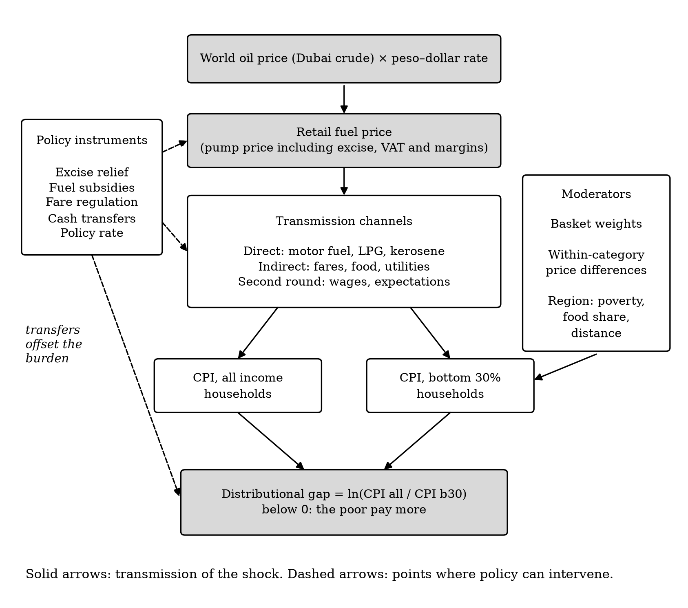
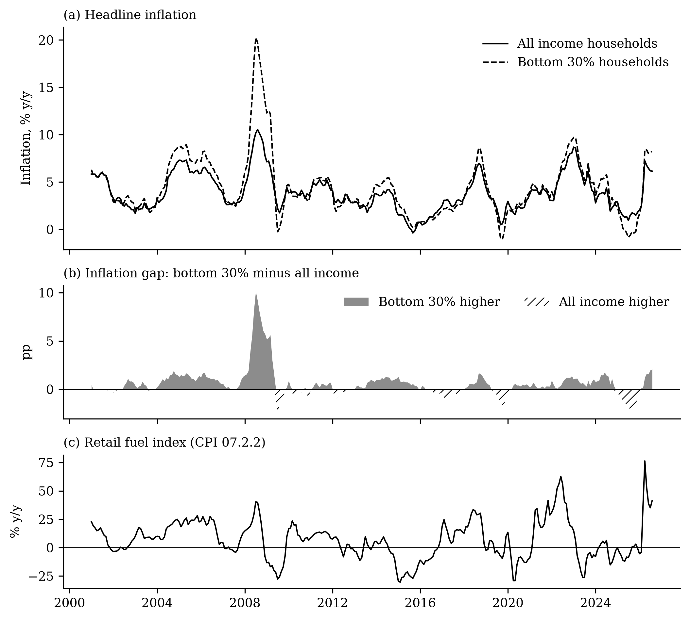
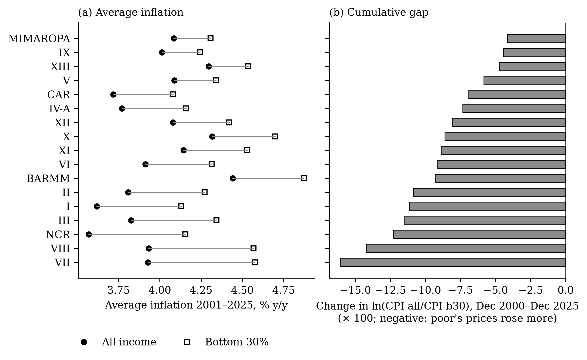
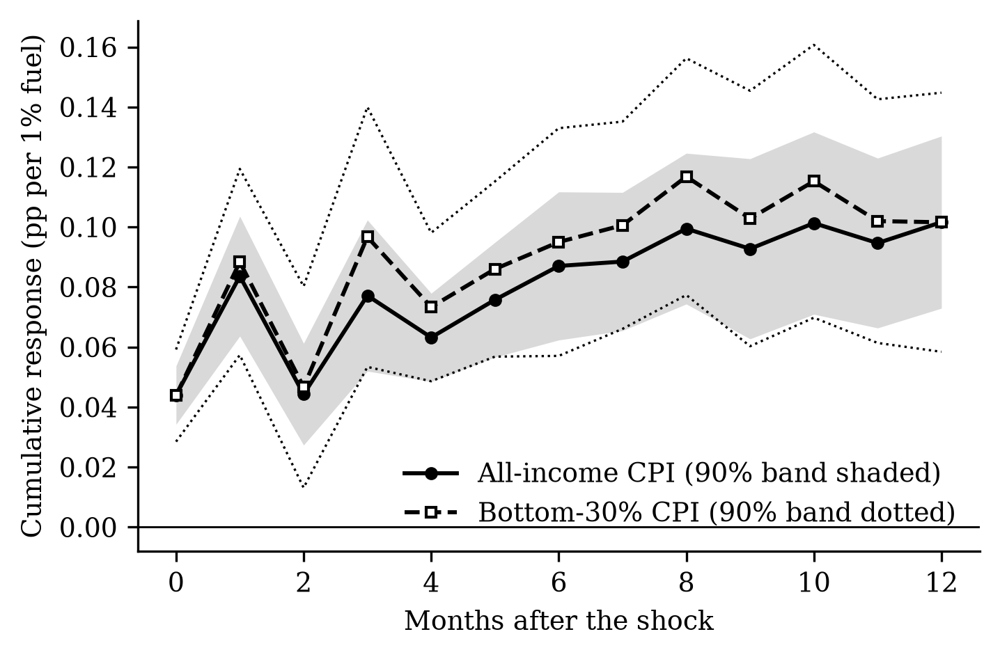
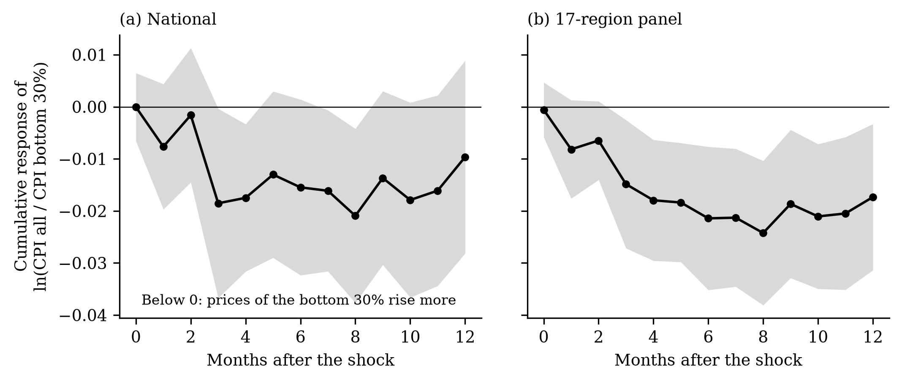
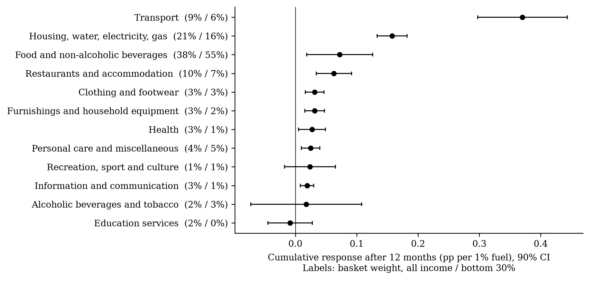
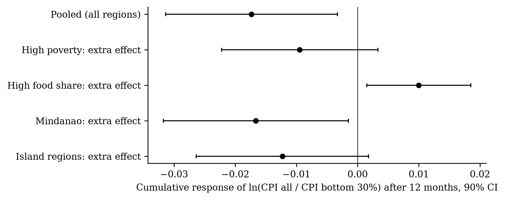
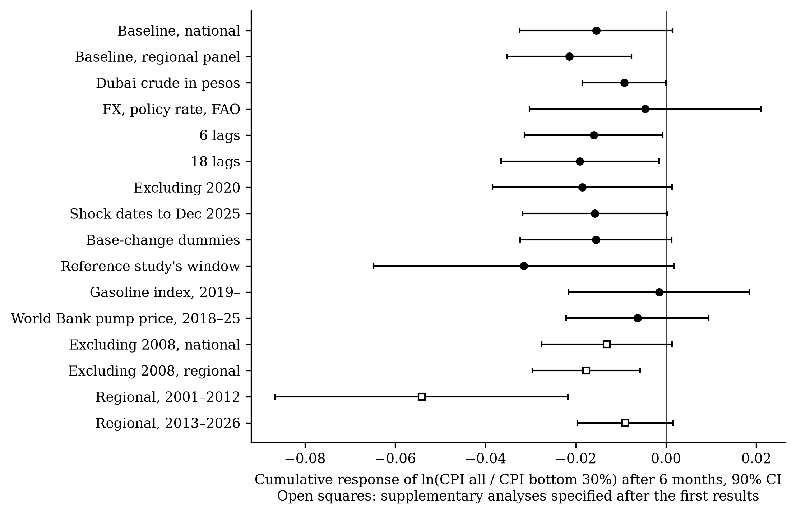
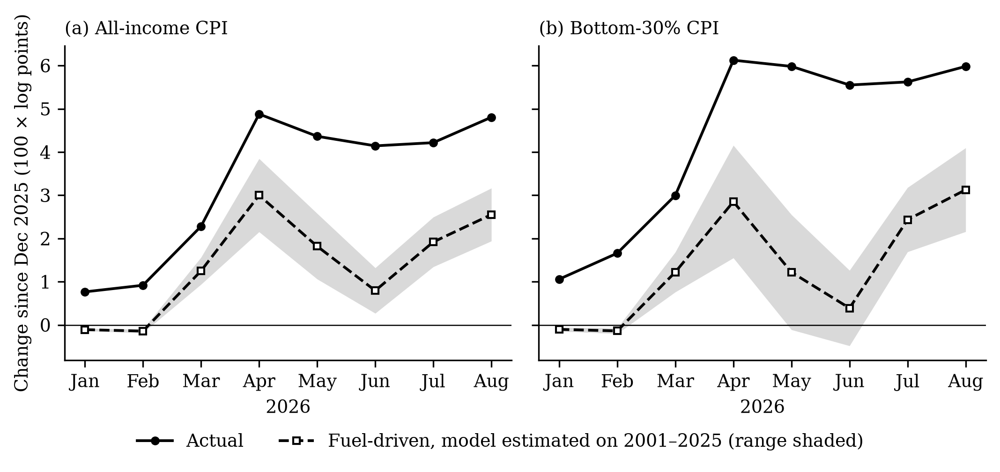
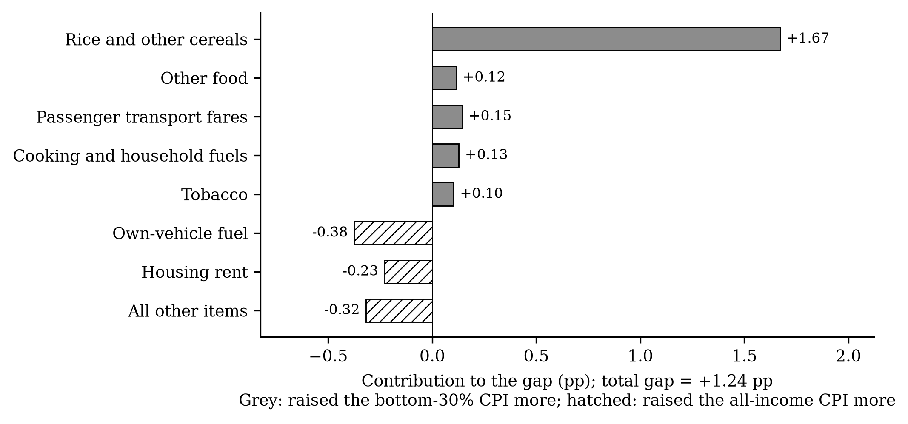

**Keywords:** oil price shock; inflation inequality; fuel price pass-through; local projections; bottom 30% CPI; regional inflation; Philippines

**JEL classification:** E31, Q41, I32, D31, R12

# Chapter 1. Introduction

## 1.1 Background of the study

The Philippines imports almost all of the petroleum it consumes, so world oil prices reach Filipino households quickly through the pump price of gasoline and diesel, the price of LPG for cooking, transport fares and the cost of moving food. The country has lived through several oil price surges since 2000: the run-up of 2004–2006, the spike of 2008 that coincided with the global rice price crisis, the post-pandemic surge of 2021–2022, and, in 2026, the oil shock caused by the conflict in the Middle East.

The 2026 shock was among the sharpest. The CPI sub-index for retail motor fuels was {{ n.yoy_fuel_mar }}% higher in March 2026 than a year earlier and {{ n.yoy_fuel_apr }}% higher in April. Headline inflation rose from {{ n.yoy_all_feb }}% in February to {{ n.yoy_all_mar }}% in March and {{ n.yoy_all_apr }}% in April, above the Bangko Sentral ng Pilipinas (BSP) target of 2–4%, and was still {{ n.yoy_all_aug }}% in August. Inflation measured by PSA's CPI for the bottom 30% income households was higher: {{ n.yoy_b30_apr }}% in April and {{ n.yoy_b30_aug }}% in August.

The government responded on several fronts. Republic Act 12316, approved on 25 March 2026, allows the President to suspend or reduce excise taxes on petroleum products for up to three months whenever Dubai crude averages USD 80 per barrel or more [@ra12316_2026]. Excise taxes on LPG and kerosene were suspended from April 2026 and again from late September, while those on gasoline and diesel were kept, on the grounds that suspending them would not be progressive. Fuel subsidies were released to public utility vehicle drivers, a one-peso increase in the jeepney minimum fare took effect at the end of September, and the BSP raised its policy rate {{ n.n_hikes_word }} times between March and August 2026, from {{ n.policy_feb }}% to {{ n.policy_aug }}%.

## 1.2 Rationale

Each of these responses rests on an assumption about who bears the cost of a fuel price shock. The best cross-country evidence answers that question in a way that would favour broad measures: @kpodar_liu_2022, using retail fuel prices for 122 countries and quintile-specific price indices reconstructed from household surveys, find that fuel price increases are *progressive* — the richest households' prices rise more, because they spend more on transport.

There are three reasons to doubt that this holds in the Philippines. First, poor Filipino households spend more than half of their budget on food and a large share on cooking fuels and public transport, so the indirect effects of fuel on food and fares may outweigh the direct effect on motor fuel. Second, the cross-country method applies the same component prices to all income groups and lets only the weights differ; if the poor buy cheaper varieties whose prices respond differently, that method cannot see it. The Philippines is one of the few countries whose statistical agency publishes an official CPI for poor households, monthly and by region, which makes a direct test possible. Third, the Philippines is an archipelago with large regional differences in poverty, diets and transport costs. A national or cross-country estimate cannot show whether households in Mindanao or the island regions bear more of the shock.

The 2026 shock gives the question practical urgency. Relief was designed in weeks; whether it reached the people who needed it depends on facts this study can establish.

## 1.3 Objectives of the study

The general objective is to determine how fuel price shocks affect the prices faced by poor households relative to all households in the Philippines, nationally and across regions, from 2001 to 2026, and what this implies for policy.

The specific objectives follow the three-objective structure of descriptive, estimation and policy analysis:

1. **Objective 1 (descriptive statistics and trend analysis).** To describe the levels, trends, volatility and co-movement of retail fuel prices, all-income inflation and bottom-30% inflation in the Philippines and its regions from 2001 to 2026, including the behaviour of the gap between the two groups during fuel-shock episodes.

2. **Objective 2 (model estimation).** To estimate, using the local projection model of @kpodar_liu_2022, (a) the size and persistence of the pass-through of retail fuel prices to the price level (RQ1); (b) whether the pass-through is larger for the bottom 30% than for all households (RQ2); (c) the CPI components through which it travels (RQ3); and (d) whether the distributional effect differs across regions grouped by poverty, food dependence and location (RQ4).

3. **Objective 3 (policy implications).** To assess, using the estimated model and the 2026 shock, (a) how much of the 2026 price surge the historical relationships explain, nationally and by region; (b) the peso cost of the shock for a poverty-line family; (c) which goods drove the poor's excess inflation; and (d) how well the policy instruments used in 2026 — excise relief, fuel subsidies, fare regulation, monetary policy and transfers — are targeted to the poor.

**Hypotheses.** For Objective 2: H1, fuel prices pass through positively and persistently to the price level, peaking within six months (as in developing economies); H2a, the effect is progressive (all-income prices rise more), as in the cross-country literature; H2b, the alternative, the effect is regressive (bottom-30% prices rise more) because of food and fares; H3, transport and food carry most of the pass-through, and food matters more for the poor; H4, the gap is wider in high-poverty, high-food-share, Mindanao and island regions.

## 1.4 Significance of the study

The study is relevant to several groups.

- *Fiscal authorities (Department of Finance, Bureau of Internal Revenue).* RA 12316 gives the President a recurring decision on fuel excise relief until 2028. The study shows which fuels' relief reaches the poor and how much it is worth to them.
- *Social protection agencies (Department of Social Welfare and Development).* The study translates a fuel shock into a monthly peso amount for a poverty-line family, by region, which can be used to size and time emergency transfers.
- *Transport and agriculture agencies (Department of Transportation, LTFRB, Department of Agriculture).* The study shows that fares and rice, not motor fuel, are the main channels through which the poor feel oil shocks.
- *The BSP.* The study measures the size and persistence of second-round effects using retail rather than crude oil prices, and shows how they differ between income groups.
- *The Philippine Statistics Authority.* The study demonstrates the value of the bottom-30% CPI and its regional detail for policy analysis.
- *Researchers.* The study provides a within-country test of a cross-country finding, a validated open-source implementation of the local projection model, and a fully reproducible data pipeline.

## 1.5 Scope and limitations

The study covers the Philippines and its 17 regions under the geographic code used in PSA's backcasts, monthly, from January 2001 to August 2026 (descriptive statistics) and with shock dates from January 2001 (estimation; the bottom-30% CPI begins in January 2000 and twelve lags are needed). It uses published price indices, not household survey microdata.

The main limitations are the following. (1) The fuel price measure is the CPI sub-index for fuels and lubricants for personal transport, because the retail price database of the reference study is not public; the sub-index tracks pump prices closely but is not a pump price. (2) The comparison is between the bottom 30% and all households, not between the poorest and the richest. (3) Retail fuel prices may respond to domestic conditions; the study uses crude oil prices as a check but not an identified oil supply shock. (4) The bottom-30% series before 2018 are PSA backcasts. (5) The 2026 analysis covers eight months, and the rice-price channel cannot be separated from trade policy. (6) Price indices measure the cost of a fixed basket and ignore substitution and income effects. These are discussed in Chapter 5.

## 1.6 Definition of terms

- **Pass-through.** The change in a price index, in percentage points, per 1% change in the fuel price.
- **Bottom-30% CPI.** PSA's consumer price index for households in the lowest 30% of the income distribution.
- **Gap.** D = ln(CPI all income / CPI bottom 30%). A fall in D means the poor's prices rose more.
- **Progressive / regressive.** A shock is progressive if it raises prices more for the better-off, regressive if it raises them more for the poor.
- **Cumulative response.** The effect of a fuel shock on the price level after *h* months, the sum of the monthly effects.
- **Local projection.** A method that estimates the effect of a shock at each future horizon with a separate regression (Chapter 3).

# Chapter 2. Review of Related Literature

## 2.1 How oil prices reach consumer prices

An increase in oil prices raises consumer prices through three channels [@blanchard_gali_2010; @choi_etal_2018; @kpodar_liu_2022]. The *direct* channel works through the fuels households buy: gasoline and diesel for vehicles, LPG and kerosene for cooking, and electricity where it is generated from oil. The *indirect* channel works through costs: transport fares, food (through fuel for farm machinery, fertilizer and freight) and other goods whose production uses energy. The *second-round* channel works through wages and expectations, when higher prices lead workers and firms to raise wages and prices further. The size of each channel depends on the energy intensity of the economy, the share of fuel taxes in pump prices, the regulation of fuel prices and fares, exchange rate movements and the credibility of monetary policy [@gelos_ustyugova_2017; @kpodar_imam_2021].

## 2.2 Empirical evidence on pass-through

The early literature used crude oil prices and found that pass-through to inflation in advanced economies fell sharply after the 1980s [@blanchard_gali_2010]. Cross-country studies find larger and more persistent effects in developing economies [@choi_etal_2018; @gelos_ustyugova_2017]. Crude oil prices, however, are a poor measure of what consumers pay: retail prices include taxes, margins and, in many developing countries, regulated adjustments. @kpodar_abdallah_2017 built a monthly database of retail fuel prices for 162 countries and showed that pass-through estimated with retail prices is larger and more persistent. @kpodar_liu_2022 extend it to 190 countries and to CPI components, finding that a 1 pp increase in gasoline prices raises inflation by about 0.04 pp at peak in advanced economies and 0.02 pp in developing economies, with more persistence in the latter, and that using crude oil prices understates pass-through mainly because fuel taxes are ignored.

Methodologically, these studies use local projections [@jorda_2005], which estimate impulse responses horizon by horizon without imposing the dynamic structure of a vector autoregression, often with the correction of @teulings_zubanov_2014. Local projections and VARs estimate the same population impulse responses [@plagborg_wolf_2021], and local projection inference is robust when lags of the variables are included [@montiel_olea_plagborg_2021].

## 2.3 Who bears the cost of fuel price changes

A large literature simulates the distributional effect of fuel price changes and subsidy reforms with input–output or general equilibrium models. It generally finds that fuel subsidies are captured by richer households and that fuel price increases are neutral or progressive, although the absolute burden on the poor can be large [@coady_etal_2015; @siddig_etal_2014; @soile_mu_2015]. Carbon pricing tends to be progressive in poorer countries [@dorband_etal_2019]. A related literature documents that inflation differs across households, usually against the poor [@easterly_fischer_2001; @kaplan_schulhofer_2017; @jaravel_2021]. @kpodar_liu_2022 is the first to estimate the distributional effect of fuel prices econometrically, using quintile CPIs reconstructed from survey expenditure shares; they find the effect progressive, more persistently so in developing economies.

## 2.4 Philippine studies

@allon_pineda_etal_2026 estimate the second-round and asymmetric effects of oil and food price shocks on Philippine inflation with local projections. @valera_etal_2025 document the changing effects of energy and rice prices, and of remittances, on overall inflation. Neither distinguishes income groups or regions. In the *Asian Economic Journal*, @armas_2021 studies the bank lending channel of monetary policy in the Philippines, @kurita_kurosaki_2011 analyse regional growth, poverty and inequality in Thailand and the Philippines, and @pagaduan_2022 studies subnational output measurement.

## 2.5 Asian evidence on shocks, poverty and regions

The *Asian Economic Journal* has a long line of work on who bears the cost of shocks and policies: the targeting of rice subsidies in Indonesia [@satriawan_shrestha_2018], food price instability in Asia [@timmer_dawe_2007], and the evolution of poverty and inequality [@warr_etal_2018; @wihardja_pradana_2024]. Subnational studies show that regions differ in their exposure to and recovery from shocks [@kataoka_2022]. Work on price transmission in the region has focused on the exchange rate and inflation targeting [@taguchi_sohn_2014].

## 2.6 Synthesis and research gap

The literature establishes that fuel prices pass through to inflation, that retail prices capture this better than crude prices, and, from cross-country data, that the effect is progressive. It leaves three gaps that this study addresses: no within-country test using official income-group price indices; no evidence on regional differences in the distributional effect; and no evidence for the 2026 shock.

## 2.7 Conceptual framework

Figure 1 summarises the framework. A rise in world oil prices, converted at the exchange rate, raises retail fuel prices, whose level also depends on taxes and margins. The shock reaches consumer prices through the direct, indirect and second-round channels. How much it raises the all-income and bottom-30% indices depends on the two groups' basket weights and on the price changes they face within each category, which in turn may depend on the region. The gap between the two indices is the distributional effect. Policy can intervene at several points: excise relief and subsidies at the retail fuel price, fare regulation in the indirect channel, monetary policy in the second round, and transfers, which offset the burden without changing prices.

{width=85%}

# Chapter 3. Digression: The Local Projection Model and How to Implement It

This chapter explains the model used for Objectives 2 and 3 and shows, step by step, how to estimate it. It is written so that a reader with a background in regression can reproduce every estimate in the paper.

## 3.1 The question an impulse response answers

Suppose the fuel price rises by 1% this month. By how much will the consumer price index be higher next month, in three months, in a year, compared with what would have happened otherwise? The sequence of answers, one per horizon, is the *impulse response function*. It cannot be read from a single regression of inflation on fuel prices, because the effect unfolds over time and because fuel prices and inflation also respond to their own past.

The traditional tool is the vector autoregression (VAR): estimate a system of equations for fuel prices and inflation with their lags, then simulate the system forward after a shock. The impulse response then depends on the whole dynamic structure being right; a misspecified lag structure distorts every horizon.

## 3.2 The local projection idea

@jorda_2005 proposed estimating the response at each horizon *h* directly, with its own regression: regress inflation *h* months ahead on today's fuel price change and on enough lags to absorb the predictable dynamics. The coefficient on today's fuel price change *is* the response at horizon *h*. Repeating this for *h* = 0, 1, …, 12 traces out the impulse response. Each regression is ordinary least squares, the specification is the same at every horizon, and no forward simulation is needed. The cost is some loss of precision at long horizons, and serially correlated errors (because the outcomes of neighbouring months overlap), which the standard errors must allow for.

## 3.3 The specification term by term

The model of @kpodar_liu_2022, which we use, is

$$
\Delta \ln y_{t+h} = \alpha_h + \sum_{q=1}^{12} \gamma_{1q}\, \Delta \ln y_{t-q} + \sum_{q=1}^{12} \gamma_{2q}\, \Delta \ln F_{t-q} + \beta_h\, \Delta \ln F_{t} + \sum_{l=1}^{h-1} \gamma_{3l}\, \Delta \ln F_{t+l} + \delta_h\, t + \varepsilon_{t+h}
$$

- **Left-hand side.** Δln y_{t+h} is the change in the log price index in month *t + h*, multiplied by 100 (approximately the monthly inflation rate in percent). The model is written in changes because the levels of prices are non-stationary (Section 5.1.6).
- **Lags of the outcome**, Δln y_{t−1}, …, Δln y_{t−12}, absorb the persistence of inflation and, because the data are not seasonally adjusted, its seasonal pattern: the coefficient on the lag that falls in the same calendar month a year earlier picks up seasonality.
- **Lags of the fuel price**, Δln F_{t−1}, …, Δln F_{t−12}, remove the part of today's inflation that is a delayed effect of past fuel shocks.
- **The shock**, Δln F_t, today's percentage change in the fuel index. Its coefficient β_h is the quantity of interest: the change in inflation in month *t + h* per 1% change in fuel prices in month *t*.
- **The Teulings–Zubanov terms**, the fuel price changes in months *t + 1*, …, *t + h − 1*. Fuel prices are persistent: a shock today is often followed by further increases. Without these terms, β_h would mix the effect of today's shock with the effect of the later shocks it predicts. Including them isolates the effect of a one-time shock [@teulings_zubanov_2014]. Following the reference study's tables, there are none at *h* = 0 and *h* = 1.
- **A linear trend** *t* and a constant α_h. In the regional panel the constant is replaced by region fixed effects.

## 3.4 From monthly effects to the price level

β_h is an effect on *inflation in one month*. Policy questions are usually about the *price level*: how much higher are prices after a year? The answer is the cumulative response, β_0 + β_1 + … + β_h. To obtain it with a correct standard error, we re-estimate the model with the cumulative change Σ_{j=0}^{h} Δln y_{t+j} = ln y_{t+h} − ln y_{t−1} on the left-hand side.

*Worked example.* With the estimates of Chapter 5, the cumulative response of the all-income CPI after twelve months is {{ n.rq1_all_c12 }}. A 10% increase in fuel prices therefore raises the price level by 10 × {{ n.rq1_all_c12 }} ≈ {{ n.rq1_all_c12_10pct }}% after a year. For the distributional gap D = ln(CPI all/CPI b30), a cumulative response of {{ n.rq4_c6 }} after six months means that a 10% fuel increase lowers D by {{ n.gap6_10pct }} log points: the poor's price level ends up {{ n.gap6_10pct }}% higher, relative to the average household's, than before the shock.

## 3.5 Standard errors

Because the outcome at horizon *h* overlaps with the outcomes of nearby months, the regression errors are serially correlated. For the national time series we use Newey–West standard errors with *h* + 1 lags [@newey_west_1987]. In the regional panel, all regions are hit by common national shocks in the same month, so errors are correlated across regions as well as over time; Driscoll–Kraay standard errors allow for both [@driscoll_kraay_1998]. Confidence bands are 90%, as in the reference study.

## 3.6 The panel version and group differences

For 17 regions *r*, the model is estimated jointly with region fixed effects u_r, using each region's own fuel index and outcome. To test whether a group of regions *G* (for example, Mindanao) responds differently, we add the interaction Δln F_{r,t} × G_r. Its coefficient θ_h is the *additional* response in group *G*; the coefficient on Δln F_{r,t} is then the response outside *G*. Because G_r does not change over time, its own effect is absorbed by the fixed effects.

## 3.7 Checking the implementation

Two checks were made before any Philippine estimate was produced. First, a *simulation test*: data are generated from a model whose impulse response is known exactly, and the estimator must recover it. Second, a *replication gate*: our code must reproduce the reference study's published results on comparable data, against criteria written down in advance. Both are described in Chapter 4 and their results in Chapter 5.

## 3.8 Step-by-step implementation

The full code is in the replication package (`ospd/lp.py` for the estimator, `scripts/` for the pipeline). The steps are:

**Step 1. Arrange the data.** One row per region and month, sorted by region and then date, with a complete monthly calendar (missing months as blank rows, so that "lag 1" is always the previous calendar month). Compute 100 × Δln of each price index and of the fuel index, and an integer month counter *t* for the trend.

**Step 2. Build the regressors for horizon *h*.** Within each region, shift the outcome forward by *h* months to obtain y_{t+h}; shift the outcome and the fuel change backward by 1 to 12 months to obtain the lags; shift the fuel change forward by 1 to *h* − 1 months to obtain the Teulings–Zubanov terms.

**Step 3. Restrict the sample** to shock dates in the estimation window *after* building the lags, so that earlier data still supply the lags of the first observations, and drop rows with any missing value.

**Step 4. Estimate by OLS** (with region fixed effects in the panel) and keep the coefficient on Δln F_t and its standard error.

**Step 5. Repeat for *h* = 0, …, 12**, and again with the cumulative outcome.

**Step 6. Plot** β_h against *h* with the 90% band β_h ± 1.645 × s.e.

A minimal version of steps 2–4 for one horizon of the national model, written in Python with *pandas* and *statsmodels*, is:

```python
import statsmodels.api as sm

def one_horizon(df, h, p=12):
    X = df[["d_fuel", "t"]].copy()
    for q in range(1, p + 1):
        X[f"y_l{q}"] = df["d_cpi_all"].shift(q)      # lags of the outcome
        X[f"f_l{q}"] = df["d_fuel"].shift(q)         # lags of the shock
    for lead in range(1, h):                         # Teulings-Zubanov terms
        X[f"f_f{lead}"] = df["d_fuel"].shift(-lead)
    y = df["d_cpi_all"].shift(-h)                    # outcome h months ahead
    data = X.assign(y=y)[df.date >= "2001-01-01"].dropna()
    res = sm.OLS(data["y"], sm.add_constant(data.drop(columns="y"))).fit(
        cov_type="HAC", cov_kwds={"maxlags": h + 1})  # Newey-West
    return res.params["d_fuel"], res.bse["d_fuel"]
```

The function `local_projection` in `ospd/lp.py` does the same for all horizons, for panels (with `linearmodels.PanelOLS` and Driscoll–Kraay errors), with interactions, controls and cumulative outcomes. For example, the regional estimate of RQ2 is obtained with

```python
from ospd.lp import local_projection
res = local_projection(regional_panel, y="d_ratio", x="d_fuel", time="t", unit="region",
                       horizons=12, p=12, se="driscoll_kraay", cumulative=True,
                       sample=regional_panel.date >= "2001-01-01")
```

which returns one row per horizon with the coefficient, its standard error, the 90% band, the number of observations and the R². The whole study — downloads, cleaning, validation, estimation, figures, tables and this document — is reproduced with the single command `./run_all.sh`.

## 3.9 Common pitfalls

- *Calendar gaps.* If a month is missing and rows are simply stacked, "lag 1" silently becomes a two-month lag. Always reindex to a complete monthly calendar.
- *Sample restriction before lagging.* Restricting the sample first throws away the data needed for the lags of the first observations.
- *Splices and base changes.* Joining series with different bases can create artificial jumps; check the months where series are joined (Section 4.2.3).
- *Seasonality.* With non-seasonally-adjusted data, twelve lags are needed; fewer lags leave seasonality in the errors.
- *Reading per-horizon coefficients as level effects.* β_h is an effect on monthly inflation, not on the price level; report cumulative responses for level questions.
- *Multiple testing.* Testing many groups or horizons makes some "significant" results likely by chance; report how many tests were run and correct for them.

# Chapter 4. Methodology

## 4.1 Research design

The study is quantitative and uses secondary, publicly available monthly data. It combines descriptive time-series analysis (Objective 1), econometric estimation with local projections on national time series and a regional panel (Objective 2), and counterfactual and accounting analysis of the 2026 episode (Objective 3). All specifications for Objective 2 were written in a decision log before any Philippine estimate was produced; analyses added afterwards are labelled as supplementary.

## 4.2 Data

### 4.2.1 Sources and variables

Table 1 lists the data. All price data come from PSA OpenSTAT [@psa_openstat_2026] and were downloaded through its public application programming interface on 4 October 2026.

**Table 1. Data sources and variables**

| Variable | Definition and source | Coverage | Use |
|---|---|---|---|
| CPI, all income households | All items and 13 COICOP divisions, 2018 = 100; PSA | Jan 1994–Aug 2026; national and 17 regions | Objectives 1–3 |
| CPI, bottom 30% income households | All items (from 2000) and commodity groups (from 2012), 2018 = 100; PSA | Jan 2000–Aug 2026; national and 17 regions | Objectives 1–3 |
| Fuel price index (shock) | CPI sub-index 07.2.2, fuels and lubricants for personal transport equipment; PSA | Jan 1994–Aug 2026; national and 17 regions | Objectives 1–3 |
| Gasoline index | CPI sub-index 07.2.2.2; PSA | Jan 2018–Aug 2026 | Robustness |
| Pump price, Manila RON 91 | World Bank Global Fuel Prices Database [@worldbank_gfpd_2025] | Jan 2017–Mar 2025 | Validation, robustness |
| Dubai and Brent crude prices | World Bank Pink Sheet [@worldbank_cmo_2026] | Monthly, to Sep 2026 | Robustness |
| Peso–dollar rate; policy rate | BSP; BIS policy rate database | Monthly | Controls |
| FAO Food Price Index | FAO | Monthly | Control |
| CPI weights, both baskets | PSA, 2018 basket | National and regional | Decompositions, region groups |
| Poverty incidence and thresholds | PSA official poverty statistics | 2018, 2021, 2023 | Region groups, peso costs |
| EU harmonised CPI; EU pump prices with and without taxes | Eurostat; European Commission Weekly Oil Bulletin [@ec_wob_2026] | 2000–2019 | Validation |

### 4.2.2 Data collection procedure

Data were collected by scripts rather than by hand, so that every file can be downloaded again and every step repeated. PSA tables were downloaded through the OpenSTAT API, one geography at a time, for the national and regional rows of 19 tables covering both baskets and all base years; files were saved unchanged and compressed. World Bank, BSP, BIS, FAO, Eurostat and European Commission files were downloaded from their official URLs. Each raw file is recorded in a source log with its URL, download date, base year and coverage. Facts about the 2026 policy response were collected from the text of RA 12316 and from official and news sources, each marked as verified or secondary.

### 4.2.3 Data processing

The raw tables were reshaped into one long table (series × region × commodity × month), with region names harmonised to standard codes. Three processing decisions matter for the results.

*Base years.* All series are on PSA's 2018 = 100 base. The bottom-30% all-items index is built by joining PSA's own backcasts for 2000–2011 and 2012–2017 to the current series from 2018. The joins were checked: month-on-month changes in the 2018-base backcast correlate perfectly with those of the 2012-base series over 2012–2017, and the changes at the joins are consistent with the older series (the January 2018 jump reflects the TRAIN law excise increase). Dummies for the two join months are used as a robustness check.

*Geography.* The bottom-30% backcasts exist only under the old geographic code (17 regions, with Negros in Regions VI and VII). The panel therefore uses the old code. For January–August 2026, published only under the new code that separates the Negros Island Region, each region's new-code monthly changes are chained onto its old-code level; the four regions whose boundaries changed are flagged and dropped in a robustness check.

*The fuel price shock.* The reference study's retail price database is not public. The CPI sub-index 07.2.2 measures the retail prices of motor fuels; its monthly changes correlate at 0.87 with the World Bank's Manila pump price over 2016–2025 and at 0.99 with PSA's gasoline-only index.

## 4.3 Methods by objective

### 4.3.1 Objective 1: descriptive statistics and trend analysis

Monthly changes (100 × Δln) of the fuel index, both CPIs and the gap are summarised by mean, annualised mean, standard deviation, minimum and maximum, for the full period and for 2001–2012, 2013–2019, 2020–2025 and January–August 2026. Annual inflation is the average of the twelve monthly year-on-year rates. *Fuel-shock episodes* are runs of at least three consecutive months in which the fuel index was 15% or more above its level a year earlier; for each, we report the peak fuel increase and average inflation for both groups. Cross-correlations between the fuel change in month *t* and the price changes in month *t + k*, *k* = 0, …, 12, describe the timing of co-movement. For each region we report average inflation for both groups over 2001–2025, the cumulative change in the gap, fuel price volatility, poverty and food share. Augmented Dickey–Fuller tests (constant and trend in levels, constant in differences; lag length by AIC) establish the order of integration of the series.

### 4.3.2 Objective 2: estimation of pass-through and distributional effects

The local projection model of Chapter 3 is estimated with *p* = 12 lags, horizons *h* = 0, …, 12 and shock dates from January 2001 to August 2026:

- **RQ1:** national, outcome Δln CPI all income and Δln CPI bottom 30%; Newey–West errors.
- **RQ2:** national, outcome ΔD = Δln(CPI all/CPI b30). A positive cumulative response supports H2a (progressive), a negative one H2b (regressive). The pre-specified judgement is based on the cumulative response at six and twelve months.
- **RQ3:** national, outcome each of the 13 COICOP divisions of the all-income CPI; and, from 2013, the matching bottom-30% divisions. A decomposition multiplies each division's cumulative response by the difference in its weight between the two baskets, which shows what the gap would be if both groups faced the same price change within each division.
- **RQ4:** regional panel of ΔD on each region's own fuel index, with region fixed effects and Driscoll–Kraay errors; then, one at a time, the interaction with dummies for high poverty (2018 poverty incidence above the median of the 17 regions), high food share (food share of the regional basket above the median), Mindanao (IX, X, XI, XII, XIII and BARMM) and island regions (MIMAROPA, VI, VII and VIII).
- **Robustness:** crude oil (Dubai, in pesos) as the shock; controls for the exchange rate, policy rate and world food prices; 6 and 18 lags; excluding 2020; shock dates only to December 2025; dummies for the base-change months; asymmetry between increases and decreases; the reference study's window (to June 2019); the gasoline index and the World Bank pump price as shocks; and, in the panel, leaving out one region at a time, dropping the re-mapped 2026 observations and using the national instead of the regional fuel index. Supplementary analyses split the sample at 2012/2013 and exclude 2008.

### 4.3.3 Objective 3: policy implications

- **Out-of-sample test of the 2026 shock.** The cumulative responses are re-estimated on data ending in December 2025 and applied to the observed 2026 fuel path: the fuel-driven change in the price level between December 2025 and month *m* is Σ_s β^{cum}_{m−s} Δln F_s, summed over the 2026 months up to *m*. This is compared with the actual change.
- **Regional burden and peso cost.** The pooled regional responses are applied to each region's fuel path. The fuel-driven rise in the bottom-30% CPI is converted to pesos for a family of five living at the official poverty line (the 2023 regional per-capita poverty threshold × 5 / 12, carried to December 2025 with the regional bottom-30% CPI).
- **Mechanism.** National responses (2013–2026) of the bottom-30% and all-income sub-indices for electricity, gas and other fuels, LPG, kerosene, solid fuels, passenger transport services and cereals, with their weights in each basket.
- **Decomposition of the 2026 gap.** The actual December 2025–August 2026 change in each index is split into item contributions using the fixed 2018 weights (descriptive, no model).
- **Assessment of instruments.** The results are used to assess the targeting of the 2026 policy instruments.

## 4.4 Validation

*Simulation.* Panels and time series are generated from y_t = 0.4 y_{t−1} + 0.04 x_t + 0.02 x_{t−1} + 0.01 x_{t−2} + e_t, whose impulse response is known. The estimator recovers it within 0.006 at every horizon with Newey–West, clustered and Driscoll–Kraay errors, recovers the cumulative response, and detects a known group difference.

*Replication gate.* Before any Philippine estimate, the estimator had to reproduce three results of @kpodar_liu_2022 on EU data (harmonised CPIs and Weekly Oil Bulletin pump prices, 2005–June 2019), under criteria written in advance: an impact response to after-tax gasoline prices between 0.035 and 0.075 (reference 0.055), near zero from the second month; a larger response to after-tax than to before-tax prices and to crude oil; and the advanced-economy shape with the EU fuels index.

## 4.5 Software and reproducibility

The analysis is written in Python 3.11 with *pandas*, *statsmodels*, *linearmodels*, *matplotlib* and *pandoc*. Every number in this paper is inserted by script from the output tables, and the command `./run_all.sh` regenerates the data, estimates, figures and this document from the raw files.

## 4.6 Ethical considerations

The study uses published aggregate statistics; no individual or household data were collected. AI tools were used in data processing, coding and drafting; [the author to complete a disclosure statement and confirm review of and responsibility for all content].

# Chapter 5. Results and Discussion

## 5.1 Objective 1: descriptive statistics and trend analysis

### 5.1.1 Summary statistics

Table 2 summarises the monthly changes. Over January 2001–August 2026, all-income prices rose at an annualised average of {{ n.d_all_mean_ann }}% and bottom-30% prices at {{ n.d_b30_mean_ann }}%; the gap therefore fell by {{ n.d_gap_mean_ann|replace("−","") }} log points a year on average. Bottom-30% inflation is also more volatile (standard deviation {{ n.d_b30_sd }} against {{ n.d_all_sd }} pp a month). The fuel index is far more volatile still (standard deviation {{ n.d_fuel_sd }} pp, with monthly changes between {{ n.d_fuel_min }}% and +{{ n.d_fuel_max }}%).

The difference between the groups was largest in 2001–2012 (annualised {{ n.d_all_p1_ann }}% against {{ n.d_b30_p1_ann }}%), narrowed in 2013–2019 ({{ n.d_all_p2_ann }}% against {{ n.d_b30_p2_ann }}%) and 2020–2025 ({{ n.d_all_p3_ann }}% against {{ n.d_b30_p3_ann }}%), and widened again in 2026 ({{ n.d_all_p4_ann }}% against {{ n.d_b30_p4_ann }}% annualised over January–August).

**Table 2. Summary statistics of monthly changes (100 × Δln), national**

{{ t.d_summary }}

### 5.1.2 Trends in inflation and fuel prices

Figure 2 and Table 3 show the annual pattern. Bottom-30% inflation exceeded all-income inflation in {{ n.d_years_b30_higher }} of the {{ n.d_years_total }} years from 2001 to 2025. The largest gap was in 2008, when the oil price spike coincided with the global rice crisis: bottom-30% inflation averaged {{ n.d_2008_b30 }}% against {{ n.d_2008_all }}% ({{ n.d_2008_gap }} pp). The gap was reversed in some years with falling food prices, most recently 2025 ({{ n.d_2025_gap }} pp), when cereal prices fell by 10–15% year on year in both baskets (PSA CPI 01.1.1).

{width=95%}

**Table 3. Annual inflation by group and fuel price change, 2001–2026**

{{ t.d_annual }}

*Notes:* Average of monthly year-on-year rates. \*2026: January–August.

### 5.1.3 Fuel-shock episodes

Table 4 lists the {{ n.d_n_episodes }} episodes in which the fuel index stayed at least 15% above its level a year earlier for three months or more. In {{ n.d_episodes_b30_higher }} of them the poor's inflation exceeded the average. The gap was largest in 2008 and second largest in 2026; the long 2021–2022 episode, with the largest fuel increase before 2026, produced a modest gap.

**Table 4. Fuel-shock episodes**

{{ t.d_episodes }}

### 5.1.4 Timing of co-movement

Table 5 shows the correlations between this month's fuel price change and price changes in the same and following months. The correlation with all-income inflation is {{ n.d_cc0_all }} in the same month and {{ n.d_cc1_all }} a month later, then falls to around zero before rising again to {{ n.d_cc6_all }} after six months — a first sign of fast direct effects and slower indirect effects. The correlation with the gap is negative in the same month ({{ n.d_cc0_gap }}) and at most lags in the first year: fuel price increases tend to be followed by faster price increases for the poor. These correlations do not control for other influences; Objective 2 does.

**Table 5. Cross-correlations of the fuel price change with later price changes**

{{ t.d_crosscorr }}

### 5.1.5 Regional patterns

Table 6 and Figure 3 compare the regions. In every region, bottom-30% prices rose more than all-income prices over 2001–2025; the cumulative gap ranges from {{ n.d_cum_gap_min }} log points in {{ n.d_cum_gap_min_reg }} to {{ n.d_cum_gap_max }} in {{ n.d_cum_gap_max_reg }} ({{ n.d_cum_gap_ph }} nationally). The gap is, perhaps surprisingly, *smaller* in poorer and more food-dependent regions (the correlation of the cumulative gap with poverty incidence is {{ n.d_corr_pov_gap }}, and with the food share {{ n.d_corr_food_gap }}). The likely reason is composition: where most households are poor, the all-income basket is itself close to the poor's basket, so the two indices move together. This pattern is important for interpreting the regional estimates in Section 5.2.4. In August 2026, bottom-30% inflation ranged widely across regions, and was highest in Mindanao and the Visayas.

{width=95%}

**Table 6. Regional summary**

{{ t.d_regional }}

### 5.1.6 Stationarity

Table 7 reports unit-root tests. The log levels of the fuel index, both CPIs and their ratio are non-stationary (the smallest p-value is {{ n.d_adf_level_pmin }}), while their monthly changes are stationary (p-values of {{ n.d_adf_diff_pmax }} or less). This supports estimating the model in changes and reporting level effects as cumulative responses.

**Table 7. Augmented Dickey–Fuller tests, January 2001–August 2026**

{{ t.d_adf }}

*Discussion.* The descriptive evidence already points against the cross-country finding: the poor's prices have risen faster than the average over 25 years and in most fuel-shock episodes. But many things change prices at the same time as fuel — rice prices, the exchange rate, policy — and the correlations are modest. Whether fuel shocks themselves raise the poor's prices more is the question for Objective 2.

## 5.2 Objective 2: estimates of pass-through and distributional effects

### 5.2.1 Validation

All three pre-registered tests passed (Table 8). On EU data, our estimate of the impact response of inflation to after-tax pump prices is {{ n.rep_after }}, against 0.055 in the reference study; the responses to before-tax prices ({{ n.rep_before }}) and Brent crude ({{ n.rep_brent }}) are close to the reference values (0.020 and 0.015) and smaller, as required; and responses fade to zero from the second month. The estimator therefore reproduces the published results, and the Philippine analysis proceeded.

**Table 8. Validation against Kpodar and Liu (2022): per-horizon responses**

{{ t.replication }}

*Notes:* Per-horizon responses of monthly inflation to a 1% fuel price change. G1–G3: EU countries, country fixed effects, clustered standard errors. Indicative row: Philippines, national, Newey–West. \*, \*\*, \*\*\*: 10%, 5%, 1%.

### 5.2.2 RQ1: pass-through to the price level

A 1% rise in the retail fuel index raises the all-income price level by {{ n.rq1_all_c0 }} pp within the month (s.e. {{ n.rq1_all_c0_se }}), {{ n.rq1_all_c6 }} pp after six months and {{ n.rq1_all_c12 }} pp (s.e. {{ n.rq1_all_c12_se }}) after a year (Table 9, Figure 4). The bottom-30% price level responds by {{ n.rq1_b30_c0 }} on impact, {{ n.rq1_b30_c6 }} after six months and {{ n.rq1_b30_c12 }} after a year. H1 is supported, with one qualification: the cumulative effect is still rising at twelve months rather than peaking within six.

Compared with the reference study, the Philippine impact response ({{ n.rq1_all_c0 }}) equals the advanced-economy estimate ({{ n.kl_adv_b0 }}) and is more than twice the developing-economy estimate ({{ n.kl_dev_b0 }}); the cumulative six-month response ({{ n.rq1_all_c6 }}) is close to the developing-economy sum ({{ n.kl_dev_cum6 }}). Motor fuel accounts for {{ n.w_fuel_all }}% of the all-income basket, so the direct effect explains about {{ n.direct_share_all }}% of the impact response; for the bottom 30%, with a fuel weight of {{ n.w_fuel_b30 }}%, only about {{ n.direct_share_b30 }}%. The rest is indirect. With Dubai crude in pesos as the shock, the twelve-month response is {{ n.crude_c12 }}, about {{ n.crude_share }}% of the retail estimate, confirming that crude prices understate pass-through.

{width=80%}

**Table 9. Cumulative responses to a 1% fuel price increase**

{{ t.main }}

*Notes:* Cumulative response (pp) of 100 × ln of each index. Gap = ln(CPI all/CPI b30); negative: bottom-30% prices rise more. National: Newey–West; panel: region fixed effects, Driscoll–Kraay. Standard errors in parentheses. \*, \*\*, \*\*\*: 10%, 5%, 1%.

### 5.2.3 RQ2: do the poor pay more?

The cumulative response of the gap is negative at every horizon after the impact month (Table 9, Figure 5): nationally {{ n.rq2_c3 }} after three months, {{ n.rq2_c6 }} (s.e. {{ n.rq2_c6_se }}) after six and {{ n.rq2_c12 }} after twelve, significant at the 10% level at horizons {{ n.rq2_sig_h }}. In the regional panel, which uses each region's own fuel prices, it is {{ n.rq4_c6 }} (s.e. {{ n.rq4_c6_se }}) after six months and {{ n.rq4_c12 }} (s.e. {{ n.rq4_c12_se }}) after twelve, both significant; dropping any one region leaves the six-month estimate between {{ n.loo_min }} and {{ n.loo_max }}. H2a (progressive) is rejected; H2b (regressive) is supported in the panel and in sign nationally. In magnitude, a 10% fuel increase raises the bottom-30% price level about {{ n.gap6_10pct }} pp more than the all-income level after six months, against a total increase of about {{ n.all6_10pct }} pp.

{width=95%}

### 5.2.4 RQ3: channels

Ten of the thirteen CPI divisions respond significantly (Table 10, Figure 6). The largest cumulative responses after a year are in transport ({{ n.rq3_transport }}), housing, water, electricity and gas ({{ n.rq3_housing }}), food ({{ n.rq3_food }}) and restaurants ({{ n.rq3_restaurants }}). H3 is partly supported: transport carries the largest pass-through, food a significant but smaller one.

The weights alone cannot explain the regressive gap. The bottom-30% basket gives food {{ n.w_food_b30 }}% against {{ n.w_food_all }}%, but transport {{ n.w_transport_b30 }}% against {{ n.w_transport_all }}%. If both groups faced the same price change within each division, the gap after a year would be *progressive* ({{ n.rq3_gap_pred }}), the cross-country result. Since the estimated gap is regressive, the poor must face larger price increases within divisions. The bottom-30% component indices (from 2013) confirm this: the poor's housing and utilities index rises {{ n.rq3b_c04_b30 }} per 1% fuel increase against {{ n.rq3b_c04_all }}, their food index {{ n.rq3b_c01_b30 }} against {{ n.rq3b_c01_all }}, while their transport index rises less ({{ n.rq3b_c07_b30 }} against {{ n.rq3b_c07_all }}) because it consists mainly of fares.

{width=85%}

**Table 10. Pass-through by CPI division, all income households**

{{ t.components }}

### 5.2.5 RQ4: regional differences

After a year, the gap is {{ n.rq4_mindanao|replace("−","") }} pp larger (per 1% fuel increase) in Mindanao (s.e. {{ n.rq4_mindanao_se }}), {{ n.rq4_island|replace("−","") }} pp in the island regions (s.e. {{ n.rq4_island_se }}) and {{ n.rq4_high_poverty|replace("−","") }} pp in high-poverty regions (s.e. {{ n.rq4_high_poverty_se }}), and {{ n.rq4_high_food }} pp *smaller* in regions with a high food share (s.e. {{ n.rq4_high_food_se }}) (Table 11, Figure 7). The Mindanao and food-share interactions are significant at 10%, but none survives a correction for testing four groups. H4 is therefore not established. The food-share result runs against the hypothesis but matches the descriptive pattern of Section 5.1.5: where most households are poor and food-dependent, the all-income basket resembles the poor's, and the gap between the two indices is mechanically smaller.

{width=80%}

**Table 11. Regional heterogeneity in the gap**

{{ t.regions }}

### 5.2.6 Robustness and stability

The negative six-month gap holds in all pre-specified robustness checks (Table 12, Figure 8). It shrinks toward zero with macro controls ({{ n.rob_macro }}), and with the two fuel series available only from 2018–2019 ({{ n.rob_gas }} and {{ n.rob_wb }}). The supplementary split shows why: in the regional panel the six-month gap is {{ n.split_p1 }} (s.e. {{ n.split_p1_se }}) over 2001–2012 and {{ n.split_p2 }} (s.e. {{ n.split_p2_se }}) over 2013–2026; excluding 2008 leaves {{ n.split_x08 }} (s.e. {{ n.split_x08_se }}). The regressive effect was strongest in the 2000s and has weakened since.

{width=85%}

**Table 12. Robustness of the distributional gap**

{{ t.robust }}

*Discussion of Objective 2.* Fuel price shocks pass through to Philippine prices as much as in the average developing economy but as fast as in advanced economies. Their distributional effect is the opposite of the cross-country finding: not progressive but, if anything, regressive. The explanation lies not in what the poor buy but in the prices they pay within the same categories, a difference that the reconstructed indices of the cross-country literature cannot capture by construction.

## 5.3 Objective 3: policy implications of the 2026 shock

### 5.3.1 How much of the 2026 surge did fuel explain?

The fuel index rose {{ n.fuel_cum_apr }} log points between December 2025 and April 2026 and was still {{ n.fuel_cum_aug }} points higher in August. A model estimated only on data up to December 2025 attributes {{ n.e1_all_fd }} log points (range {{ n.e1_all_lo }}–{{ n.e1_all_hi }}) of the {{ n.e1_all_act }}-point rise in the all-income CPI by August to fuel, about {{ n.e1_all_share }}%, and {{ n.e1_b30_fd }} ({{ n.e1_b30_lo }}–{{ n.e1_b30_hi }}) of the {{ n.e1_b30_act }}-point rise in the bottom-30% CPI, about {{ n.e1_b30_share }}% (Figure 9). It also predicts that the poor would pay more: {{ n.e1_gap_fd }} pp of the {{ n.e1_gap_act }} pp actual gap. The historical relationships thus held in 2026, but explain only half of what happened. Prices did not fall when fuel prices eased in May and June, as the model predicted, consistent with downward price rigidity and with other shocks, including a {{ n.peso_dep_feb_aug }}% depreciation of the peso between February and August.

{width=95%}

### 5.3.2 Regional burden and peso cost

For a family of five at the poverty line, the fuel-driven increase in the cost of its basket by August 2026 was about PHP {{ n.e3_ph_cost }} a month nationally, from PHP {{ n.e3_min }} in {{ n.e3_min_reg }} to PHP {{ n.e3_max }} in the {{ n.e3_max_reg }} (Table 13). The total price-driven increase was about PHP {{ n.e3_ph_actual_cost }} a month. Fuel-driven increases were similar across regions because pump prices moved together, but actual bottom-30% inflation was much higher in {{ n.e2_top_names }} than in the National Capital Region, and fuel explains about {{ n.e2_luz_share }}% of the rise in NCR, CAR and Regions I to IV-A but only {{ n.e2_mind_share }}% in Mindanao.

**Table 13. The 2026 shock by region, December 2025 to August 2026**

{{ t.regional2026 }}

*Notes:* 100 × log points. Fuel-driven rise: pooled responses estimated to December 2025 applied to each region's fuel path; indicative range in brackets. †: boundaries changed in 2024.

### 5.3.3 Which goods drove the poor's excess inflation?

Between December 2025 and August 2026, the bottom-30% CPI rose {{ n.e5_b30_total }}% and the all-income CPI {{ n.e5_all_total }}%, a gap of {{ n.e5_total_gap }} pp (Figure 10). Rice and other cereals contributed {{ n.e5_cereals_gap }} pp: cereal prices rose {{ n.e5_cereal_pct_b30 }}% in the poor's basket and {{ n.e5_cereal_pct_all }}% in the average, and cereals weigh {{ n.e5_cereal_w_b30 }}% against {{ n.e5_cereal_w_all }}%. Passenger fares added {{ n.e5_fares_gap }} pp (the poor's fares rose {{ n.e5_fares_pct_b30 }}%, against {{ n.e5_fares_pct_all }}%), and household fuels {{ n.e5_hhfuel_gap }} pp. Private vehicle fuel ({{ n.e5_ownfuel_gap }} pp) and rents ({{ n.e5_rent_gap }} pp) worked the other way. Historically, cereal prices barely respond to pump prices ({{ n.e4_f0111_b30 }}–{{ n.e4_f0111_all }} after a year), so the 2026 rice increase probably reflects the conflict's effect on fertilizer and freight costs and changes in rice import policy [@usda_fas_2026] more than the direct pass-through of fuel; the data cannot separate these causes.

{width=85%}

Table 14 shows the household fuels and fares behind these results. LPG prices respond equally in both baskets ({{ n.e4_e0452_all }} and {{ n.e4_e0452_b30 }}), and LPG has the same weight in both ({{ n.e4_e0452_all_w }}% and {{ n.e4_e0452_b30_w }}%). Kerosene responds strongly but weighs only {{ n.e4_e0453_b30_w }}% even for the poor. Solid fuels — charcoal and wood — weigh {{ n.e4_e0454_b30_w }}% for the poor against {{ n.e4_e0454_all_w }}% for the average, but do not respond to oil prices. The poor's fares have historically responded little ({{ n.e4_t073_b30 }} against {{ n.e4_t073_all }}).

**Table 14. Household fuels, fares and cereals: weights and responses, 2013–2026**

{{ t.mechanism }}

### 5.3.4 Assessment of the 2026 policy instruments

Table 15 brings the evidence together.

**Table 15. Assessment of policy instruments against the evidence**

| Instrument (2026) | Evidence from this study | Assessment |
|---|---|---|
| Excise relief on gasoline and diesel (not used) | Motor fuel weighs {{ n.w_fuel_all }}% of the all-income basket and {{ n.w_fuel_b30 }}% of the poor's; private vehicle fuel lowered the poor's relative inflation by {{ n.e5_ownfuel_gap|replace("−","") }} pp in 2026 | Benefits mainly better-off households; not targeted. The decision not to use it is consistent with the evidence. |
| Excise suspension on LPG and kerosene (April–July and from September 2026) | LPG responds equally in both baskets and has the same weight; kerosene responds strongly but weighs {{ n.e4_e0453_b30_w }}% for the poor; relief of about PHP 37 per 11-kg tank ≈ {{ n.lpg_relief_share }}% of the fuel-driven monthly cost of a poverty-line family | Distribution-neutral (LPG) or well targeted but small (kerosene); limited protection for the poor. |
| Fuel subsidies for public utility vehicle drivers | The poor's fares historically responded little to fuel ({{ n.e4_t073_b30 }}); in 2026 their fares rose {{ n.e5_fares_pct_b30 }}% against {{ n.e5_fares_pct_all }}% | Protects the poor indirectly by delaying fare increases; worth continuing while fares are held, and monitoring local fares. |
| Policy rate increases (to {{ n.policy_aug }}%) | Pass-through builds for at least 12 months; crude-based estimates understate it by more than half | Appropriate against second-round effects, but does not address the distribution of the burden. |
| Targeted cash transfers | Fuel-driven cost PHP {{ n.e3_ph_cost }} a month and total price-driven cost PHP {{ n.e3_ph_actual_cost }} a month for a poverty-line family of five by August 2026; regional range PHP {{ n.e3_min }}–{{ n.e3_max }} | Best targeted; can be sized and regionally allocated with the bottom-30% CPI. |
| Rice price and supply measures | Rice and cereals contributed {{ n.e5_cereals_gap }} pp of the {{ n.e5_total_gap }} pp gap in 2026 | The largest channel of the poor's excess inflation in 2026; should be part of the oil-shock response. |

## 5.4 Synthesis

The three objectives give a consistent picture. The descriptive record (Objective 1) shows that the poor's prices have risen faster than average over 25 years and during most fuel-shock episodes. The model (Objective 2) shows that fuel shocks themselves contribute to this — the opposite of the cross-country finding — through larger price increases within the categories the poor buy, especially in the 2000s. The 2026 episode (Objective 3) shows that the historical model still predicts about half of the price surge and the direction of the gap, but that the poor's excess inflation in 2026 came mostly through rice, a channel that pump-price-focused relief does not reach.

The results qualify the policy conclusion usually drawn from the cross-country evidence. In the Philippines, fuel subsidies and excise relief are still poorly targeted — that conclusion stands — but not because fuel shocks spare the poor. They do not; the poor are reached through food and fares, which fuel tax relief does not touch.

*Limitations.* Retail fuel prices may respond to domestic conditions; crude-price results have the same sign, but an identified oil supply shock [@kilian_2009; @baumeister_hamilton_2019; @kanzig_2021] would strengthen the causal interpretation. The bottom 30% are compared with all households, which understates differences. The pre-2018 bottom-30% series are backcasts. The distributional effect is concentrated in 2001–2012 and is sensitive to some controls. The 2026 analysis is short and its decomposition descriptive. The regional tests do not survive a multiple-testing correction. Price indices ignore substitution and income effects.

# Chapter 6. Summary, Conclusions and Recommendations

## 6.1 Summary of findings

**Objective 1.** From 2001 to 2025, bottom-30% prices rose faster than all-income prices on average ({{ n.d_infl_b30_ph }}% against {{ n.d_infl_all_ph }}% a year) and in {{ n.d_years_b30_higher }} of {{ n.d_years_total }} years, accumulating to a {{ n.d_cum_gap_ph|replace("−","") }}-log-point difference nationally and a difference in every region. The poor's inflation exceeded the average in {{ n.d_episodes_b30_higher }} of {{ n.d_n_episodes }} fuel-shock episodes, most in 2008 and 2026. In August 2026 it was {{ n.yoy_b30_aug }}% against {{ n.yoy_all_aug }}%.

**Objective 2.** A 1% fuel price increase raises the price level by {{ n.rq1_all_c0 }} pp within the month and {{ n.rq1_all_c12 }} pp within a year; crude prices capture about {{ n.crude_share }}% of this. The effect is not progressive: in the regional panel, the poor's prices rise {{ n.rq4_c6|replace("−","") }} pp more after six months, through larger increases within food, utilities and other categories, while the expenditure weights alone would predict the opposite. The effect was strongest in 2001–2012. Regional differences are suggestive but not statistically established.

**Objective 3.** The historical model explains about half of the 2026 price surge and predicts that the poor would pay more. The fuel-driven cost for a poverty-line family of five reached about PHP {{ n.e3_ph_cost }} a month by August 2026 (total price-driven cost about PHP {{ n.e3_ph_actual_cost }}). Rice and cereals accounted for most of the poor's excess inflation. LPG excise relief is distribution-neutral; gasoline and diesel tax relief would mainly help the better-off.

## 6.2 Conclusions

1. Fuel price shocks pass through quickly, broadly and persistently to Philippine consumer prices; analyses based on crude oil prices understate them.
2. The cross-country finding that fuel shocks are progressive does not hold in the Philippines. The burden is at best neutral and often falls harder on poor households.
3. The reason is not the poor's spending pattern, which by itself would make the shock progressive, but the price changes they face within categories — their food, their household fuels and, in 2026, their fares.
4. The 2026 shock confirmed the historical relationships but added a large rice-price channel that fuel-focused relief does not reach.
5. Instruments that work through fuel taxes are poorly targeted to the poor; transfers sized with the bottom-30% CPI, fare policy and rice policy are better targeted.

## 6.3 Recommendations

*For policy.*

1. **Department of Finance:** reserve excise relief under RA 12316 for products whose budget share is clearly higher for the poor (kerosene) and avoid broad relief on gasoline and diesel; redirect the revenue to targeted transfers.
2. **Department of Social Welfare and Development:** use existing registries of poor households to release emergency transfers when a fuel shock occurs, sized with the bottom-30% CPI (on 2026 evidence, PHP {{ n.e3_ph_cost }}–{{ n.e3_ph_actual_cost }} a month for a poverty-line family of five) and allocated by regional bottom-30% inflation rather than regional pump prices; keep them for at least a year, because prices do not fall back when fuel eases.
3. **Department of Transportation and LTFRB:** treat fuel subsidies for public transport operators as protection for poor commuters, tie them to fare restraint, and monitor local fares (such as tricycle fares) that are not set nationally.
4. **Department of Agriculture:** include rice in the oil-shock response, through monitoring of fertilizer and freight costs and timely use of import and buffer-stock policy.
5. **BSP:** use retail fuel prices, not crude prices, to gauge second-round effects, and recognise that they build over at least a year.
6. **PSA:** continue and publicise the bottom-30% CPI and its regional and commodity detail, and publish technical notes on its backcasts.

*For research.*

1. Use an identified oil supply shock as an instrument for retail fuel prices.
2. Compare the poorest and the richest households directly, with FIES-based indices for the top of the distribution.
3. Study the fertilizer–rice channel of oil shocks with longer horizons.
4. Extend the 2026 analysis as data for later months become available, including the September 2026 fare increase and the second excise suspension.
5. Examine income effects — on drivers, farmers and fisherfolk — alongside price effects.

# References

::: {#refs}
:::

# Appendix A. Reproducing the study

The replication package contains the raw data with a source log, the code for every step, the decision log recording when each specification was fixed, the output tables, the figures and this document. Running `./run_all.sh` in a Python 3.11 environment with the packages in `requirements.txt` regenerates all of them; `./run_all.sh --download` first downloads the PSA tables again. A separate *Analysis and Results Report* lists every estimate, and the *Master Document* describes the whole process of data collection, analysis and interpretation.
